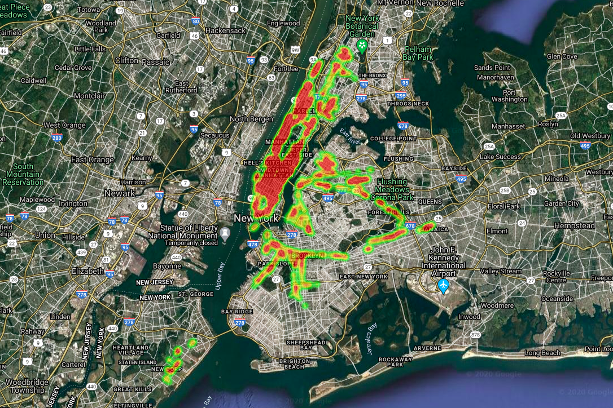
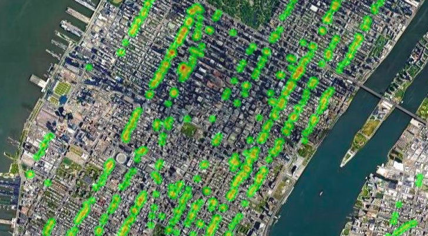

# LINK_NYC_heatmap

Building heatmap of all the LINK NYC Wifi hotspots in New York City. 

## Built with

*  Python
*  Pandas
*  Matplotlib
*  Gmaps
*  Geopandas

## Data 

Data provided by NYC Open Data (https://opendata.cityofnewyork.us)

*  Census_Demographics_at_the_Neighborhood_Tabulation_Area__NTA__level
*  NYC_Wi-Fi_Hotspot_Locations.csv
*  Neighborhood Tabulation Areas (NTA).csv

## API

API key for Google Maps needed (https://console.cloud.google.com)

## Results:

